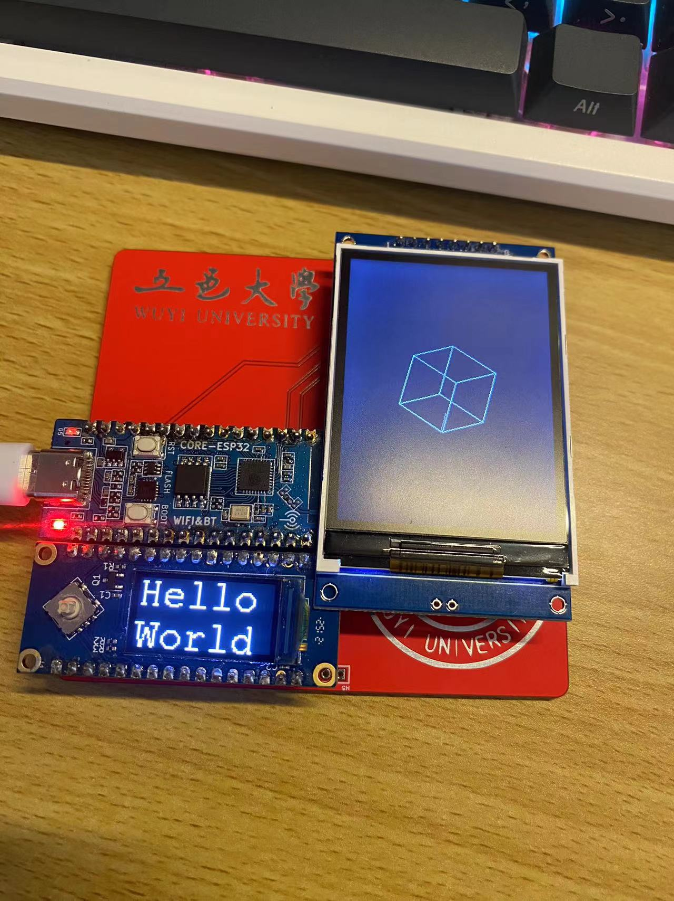
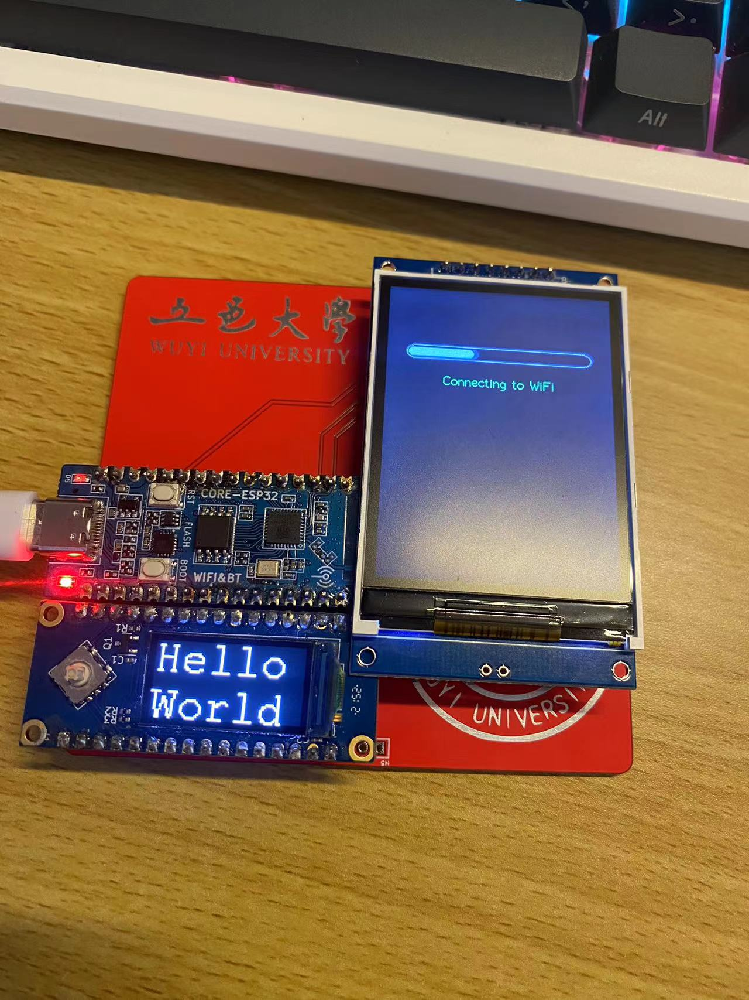
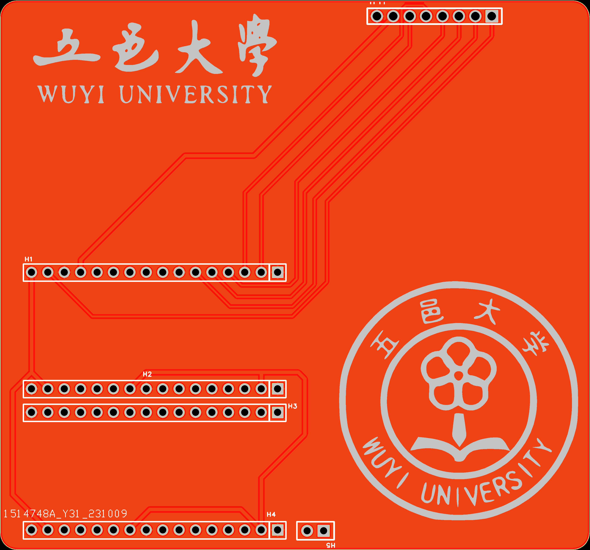
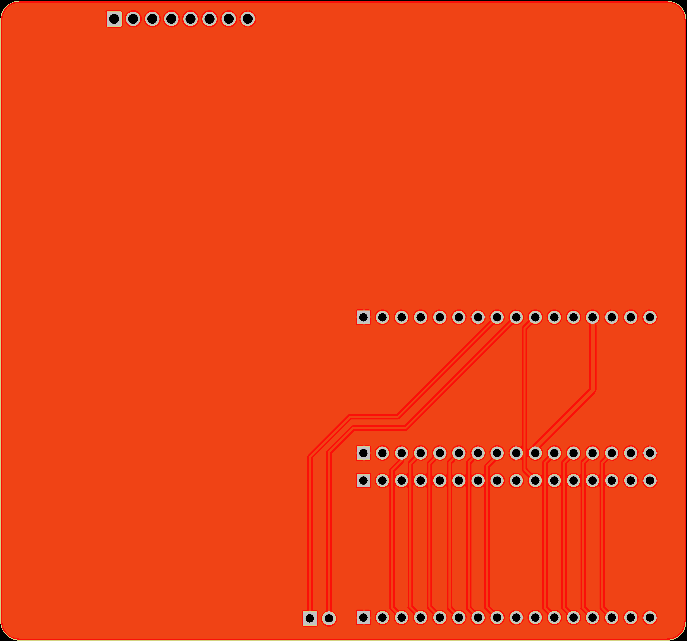
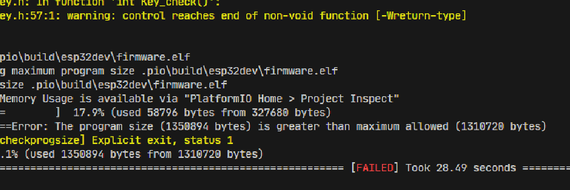

## 基于Socket通信的电脑智能监控硬件

## 技术实现

### 文件目录说明

## 1-硬件

### 实物图

### 电路图

### PCB仿真图

#### 2023-10-9

### Gerber文件

https://github.com/Yu-1120/Monitoring-Hardware/blob/master/hareware/V1_2023-10-13/Gerber_PCB1_2023-10-13.zip

### 可以优化的地方

#### 2023-10-18-12点54分

## 2-软件

### 

## 参考链接（调用的库）

- https://blog.csdn.net/u013742125/article/details/130592427     TFT_eSPI库之相关API

- https://blog.csdn.net/qq_43415898/article/details/129126193    驱动两个spi屏的问题

- Adafruit_GFX

- 

