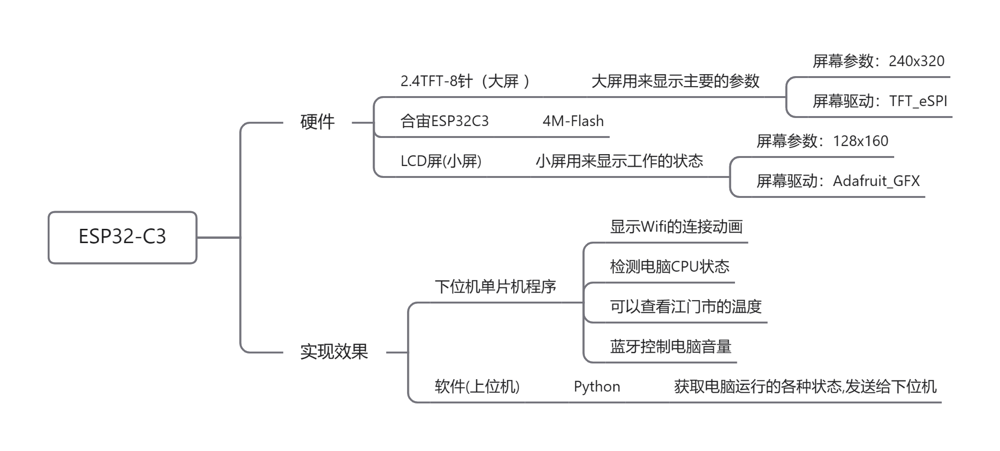

# 更新记录 （已验证）

|   时间    |              更新内容                        |
|  2023-10-2  |               完成PCB的布线                        |
| ---------------------- | ------------------------------------------------------------ |
| 2023年10月16日18点33分 | 成功运行                                                     |
| 2023-10-18-12点54分    | 集成了天气，上位机TCP通信传输数据到单片机                    |
| 2023年10月19日13点14分 | 集成了天气，上位机TCP通信传输数据到单片机，**集成到蓝牙（做为一个模拟键盘）** |
| 2024年2月6日18点43分   | 把硬件开源到嘉立创  [合宙ESP32C3-LCD-TFT屏-2023-10-2-V1 - 嘉立创EDA开源硬件平台 (oshwhub.com)](https://oshwhub.com/xiaoyu_student/he-zhou-esp32c3-lcd-tft-ping-2023-10-2-v-1-0-0) |
| 2024年2月6日18点43分   | 更新硬件需要购买的                                           |

# 视频地址

https://www.bilibili.com/video/BV1KH4y1d7iv/?spm_id_from=333.999.0.0

# 基于Socket通信的电脑智能监控硬件

## 项目介绍

​	本项目是基于ESP32C3的软硬件结合的项目，单片机的控制程序和上位机的TCP 传输数据程序，相比之下,上位机的编写是较为简单的，做一个关于显示电脑参数的硬件，可以通过TCP传回显示CPU的运行速度，可以通过Wifi获取到Http上的天气数据，也可以把当成蓝牙键盘来进行操作电脑。

## 技术实现

## 主要功能

自动配网功能是通过WiFi设置是储存在它的闪存系统中的。因此在启动ESP8266并连接WiFi时，它都会尝试使用闪存系统中储存的信息来进行WiFi连接。这个避免是我们在连接WiFi的时候，不同的环境去连接WiFi，需要重新烧录代码的情况， 通过TCP协议对主控IC连接WiFi名字和密码进行修改，再次重新连接。

天气感知是通过是调用心知天气的Http接口，返回的Json数据进行解析的，得到准确的温度信息和城市。然后通过单片机对传过来的数据进行处理，并显示在LCD屏上。

电脑性能数据的传输，先由单片机对电脑热点的建立连接，后由Python编写的上位机的程序，通过同一局域网下连接单片机的IP地址和端口来进行连接，传输电脑CPU，GPU的占用率给单片机进行显示。

Python 上位机的调用  psutil ，socket , PyQt5, FluentUI来进行编写，通过psutil来读取电脑CPU 的性能，然后通过socket来进行对单片机来通信，FluentUI是主要来界面美化UI的界面，可以通过简单的调用就可以调出想要的效果。

蓝牙键盘控制是通过单片机上的上下左右来进行控制电脑，往上面是提高音量，向下是减低音量，向中间按是禁音，向右是打开浏览器搜索，向左是打开文件管理器。

## 硬件

### 实物图

### PCB仿真图

`2023-10-9 Gerber文件`

https://github.com/Yu-1120/Monitoring-Hardware/blob/master/hareware/V1_2023-10-13/Gerber_PCB1_2023-10-13.zip

### 硬件需要购买

## 软件

## 参考链接（调用的库）

- https://blog.csdn.net/u013742125/article/details/130592427     TFT_eSPI库之相关API
- https://blog.csdn.net/qq_43415898/article/details/129126193    驱动两个spi屏的问题
- Adafruit_GFX（小的屏幕驱动)
- [ESP32的蓝牙库: ESP32的蓝牙库ESP32的蓝牙库 (gitee.com)](https://gitee.com/its-a-slap/bluetooth-library-for-esp32)
- [ESP32C3: ESP32C3-arduino固件 (gitee.com)](https://gitee.com/its-a-slap/esp32-c3)

## 总结

这个项目是我一直想做的，但又没啥时间，趁着这次大作业，随便做了，项目不难，只是把之前学过的东西整合到一起去了。意义上之前的项目的积累，才有了这个项目。

这个项目的第一个缺点是主控芯片外置Flash 只有4M-Flash，需要我们在代码上进行优化。尽可能压缩代码编译后体积变小。第二个硬件是连接主要是通过排针排母连接的方式无法把体积做到最小。

